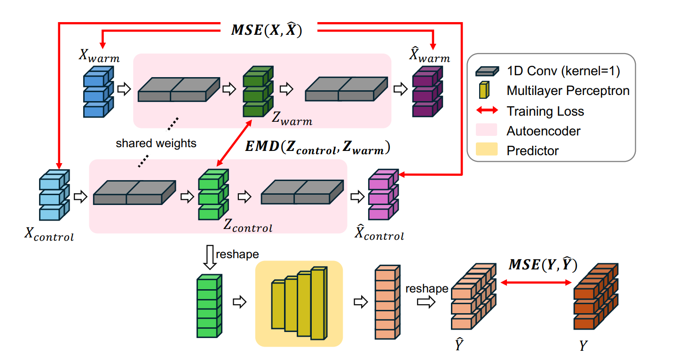
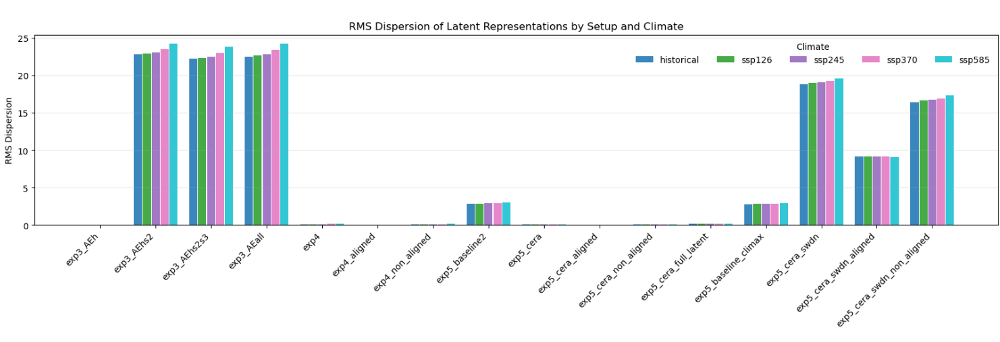
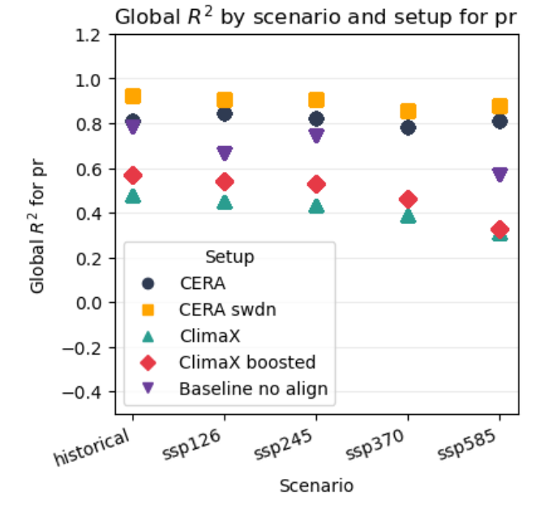
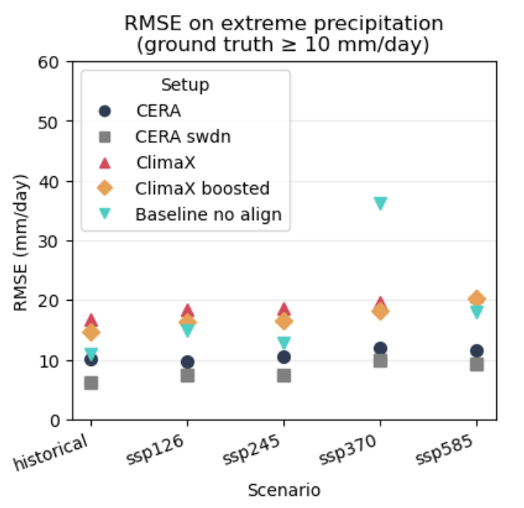
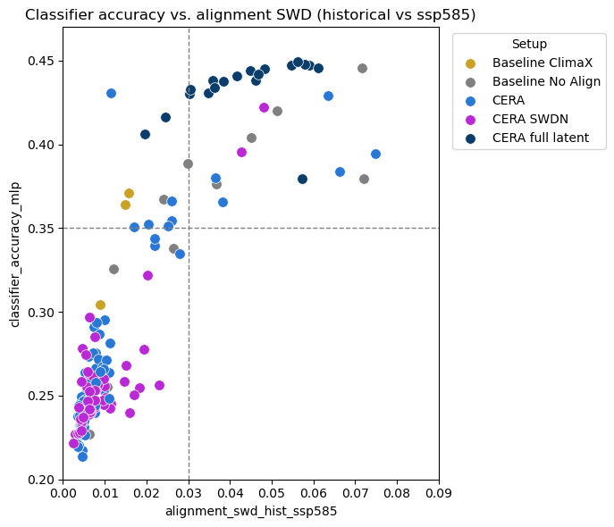
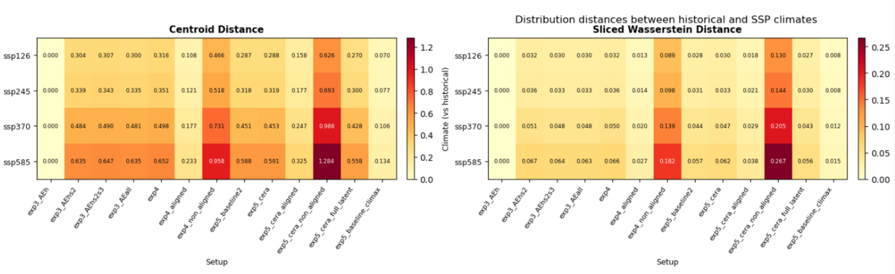

# Climate-Invariant Representation Learning

**Research project — Gentine Lab, Columbia University · New York, USA · April–August 2026**

> **Can climate models learn representations that remain predictive as the climate changes?**  
> Investigating latent alignment, climate invariance, physical structure, and out-of-distribution generalization on CMIP6 climate simulations.

## Abstract

Machine-learning models for climate science are often trained on historical conditions but deployed under future climates that differ substantially from their training distribution. **Climate-invariant machine learning** addresses this problem by seeking representations in which predictive relationships remain stable across climate regimes.

In this work, I evaluate **Climate-invariant Encoding through Representation Alignment (CERA)** on realistic **CESM2/CMIP6** simulations spanning Historical conditions and four future SSP scenarios. Beyond predictive performance, I analyze the learned latent spaces to test CERA's central hypothesis: whether cross-climate representation alignment promotes climate invariance and whether such invariance is associated with robust out-of-distribution (OOD) prediction.

The analysis reveals that standard Sliced Wasserstein alignment can partially minimize its objective through **latent-space shrinkage**, motivating **Normalized Sliced Wasserstein Distance (SWDN)**, a modified alignment objective designed to remove sensitivity to global rescaling. SWDN avoids this rescaling failure mode while improving precipitation prediction across future climates and extreme precipitation events.

Across **186 model configurations**, the results reveal an asymmetric relationship between representation properties: strong alignment appears **necessary but not sufficient** for climate invariance, while climate invariance and physically structured representations characterize nearly all high-performing OOD models without guaranteeing high performance themselves. Interestingly, **ClimaX** also exhibits substantial cross-climate alignment without an explicit alignment objective in this experiment, suggesting that climate-invariant structure can emerge in pretrained climate representations.

---

## 1. Motivation & Related Work

Climate change creates a fundamental **out-of-distribution learning problem**: models trained on historical conditions must remain accurate under warmer climate regimes whose multivariate distributions may differ substantially from those observed during training.

[**Beucler et al. (2024), _Climate-invariant machine learning_**](https://doi.org/10.1126/sciadv.adj7250) showed that physically motivated transformations can improve generalization across climates by expressing atmospheric relationships in forms that remain more stable under climate change. This approach, however, relies on identifying and engineering suitable transformations from physical knowledge.

[**Liu & O'Gorman (2026), _CERA: A Framework for Improved Generalization of Machine Learning Models to Changed Climates_**](https://doi.org/10.1029/2025MS005431) proposed learning climate-invariant representations automatically. CERA combines an autoencoder with explicit cross-climate latent-space alignment and a downstream predictor, providing a data-driven alternative to manual invariant feature engineering.

A complementary direction is large-scale pretraining through climate foundation models. [**Agana Navarro et al. (2026), _Assessing the Robustness of Climate Foundation Models under No-Analog Distribution Shifts_**](https://arxiv.org/abs/2603.23043) evaluated models including **ClimaX** under historical-only training and future forcing shifts. Their results show that strong absolute predictive performance does not eliminate sensitivity to no-analog climate distribution shifts, motivating explicit evaluation of representation robustness under future climates.

Building on these directions, this project asks:

1. **Does CERA generalize to realistic CMIP6 climate shifts?**
2. **Does latent alignment actually produce climate-invariant representations, and how is this related to OOD prediction?**
3. **Do climate-invariant representations preserve or reveal physically meaningful atmospheric structure?**
4. **Do pretrained climate representations such as ClimaX develop climate invariance without explicit alignment?**

---

## 2. Methodology

### 2.1 Climate data and OOD setting

Experiments use daily climate fields from **CESM2 / CMIP6**:

- Historical + **SSP1-2.6, SSP2-4.5, SSP3-7.0, and SSP5-8.5**
- **16 atmospheric and surface variables**
- ~**1,000 × 1,000 km** multivariate spatial patches
- Tropical domain spanning approximately **30°S–30°N**
- Up to **2.5 million climate samples**

The progressively warmer SSP scenarios provide a controlled setting for evaluating how learned representations and prediction performance evolve as the climate moves away from Historical conditions.

### 2.2 CERA architecture

CERA combines three objectives:

**Objective:** $L = (1 - \lambda_{rec} - \lambda_{align})L_{pred} + \lambda_{rec}L_{rec} + \lambda_{align}L_{align}$

where $L_{pred}$ is the supervised prediction loss, $L_{rec}$ the reconstruction loss, and $L_{align}$ the cross-climate representation alignment loss.

A shared convolutional **encoder** maps multivariate climate patches into a latent representation. A **decoder** reconstructs the original climate state, while a **predictor** estimates downstream climate variables from an aligned subset of the latent representation.



*Figure 0 — Overview of the Climate-Equivariant Representation Alignment (CERA) framework. Latent representations from a control and a warm climate are aligned through an Earth Mover’s Distance regularization, while prediction is performed using the aligned component of the latent space.*

Prediction is supervised using **Historical labels only**. Future-climate samples can contribute to reconstruction and latent alignment without providing downstream prediction labels, allowing OOD predictive performance to be evaluated independently.

### 2.3 From SWD to normalized alignment

The original CERA framework uses distribution matching to align representations across climates. For the higher-dimensional spatial representations considered here, I use **Sliced Wasserstein Distance (SWD)** as the reference alignment objective.

Analysis of the resulting latent spaces revealed an important failure mode: standard SWD can reduce cross-climate distances partly through **global contraction or rescaling of the latent space**, reducing the alignment objective without necessarily improving the relative organization of climate states.

I therefore introduce **Normalized Sliced Wasserstein Distance (SWDN)**, which normalizes latent geometry before computing alignment. This makes the objective insensitive to global rescaling and forces the optimization to act on relative cross-climate geometry rather than simply reducing representation magnitude.

### 2.4 Experimental controls and representation analysis

The experiments compare:

- **CERA** — reconstruction + SWD alignment + prediction
- **CERA-SWDN** — CERA with normalized SWD
- **NoAlign** — the same architecture without an alignment objective
- **CERA-Full** and other architectural/alignment variants
- Simple learned and physically informed baselines
- **ClimaX** and **ClimaX-Boosted**, using pretrained climate representations with Historical-only downstream training

To investigate *why* models generalize, I analyze their latent spaces using:

- cross-climate **Sliced Wasserstein and centroid distances**;
- **climate-classification probes** measuring how easily the climate scenario can be recovered from a representation;
- PCA, t-SNE, latent geometry, and cross-climate nearest neighbors;
- correlations between latent distance and predefined **physical-invariant candidates**;
- **generalized eigenanalysis** to identify cross-climate invariant latent directions;
- LASSO attribution and symbolic regression for exploratory physical-invariant discovery.

Alignment strength is varied across configurations, yielding **186 representation/prediction settings** for studying relationships between alignment, invariance, and OOD performance.

---

## 3. Results

### 3.1 CERA transfers to CMIP6, but standard alignment can shrink the latent space

CERA remains predictive across increasingly warm CMIP6 scenarios, supporting the transfer of climate-aligned representation learning from the original CERA setting to a more realistic climate distribution shift.

However, inspecting the learned representations reveals that low alignment distance can be achieved partly by **shrinking the latent space**. Standard SWD therefore risks confounding genuine cross-climate alignment with a global reduction in representation scale.



*Figure 1 — RMS dispersion of latent representations across model configurations and climate scenarios. Standard alignment can strongly contract latent representations, motivating a scale-insensitive alignment objective.*

This observation motivated treating latent geometry itself as an object of study rather than relying on the alignment loss alone.

### 3.2 SWDN removes the rescaling shortcut and improves OOD precipitation prediction

SWDN removes sensitivity of the alignment objective to global latent rescaling. The resulting model achieves stronger downstream precipitation performance across the evaluated climate scenarios.



*Figure 2 — Global precipitation prediction performance across Historical and future SSP scenarios.*

**CERA-SWDN achieves the highest precipitation ($R^2$) across all evaluated scenarios.** From Historical to SSP5-8.5, its ($R^2$) decreases from approximately **0.91 to 0.87**, compared with **0.58 to 0.37 for ClimaX-Boosted**. The corresponding decrease, 0.04 versus 0.21, is approximately **81% smaller** for CERA-SWDN in this evaluation.

The improvement also extends to the tail of the precipitation distribution:



*Figure 3 — RMSE for extreme precipitation events (ground truth ≥ 10 mm/day) across Historical and future climate scenarios.*

For precipitation events above **10 mm/day**, CERA-SWDN achieves the lowest RMSE among the evaluated approaches across Historical and future SSP scenarios, indicating that its advantage is not restricted to mean precipitation behavior.

### 3.3 Alignment produces climate invariance — but alignment alone is not sufficient

A central assumption behind CERA is that distribution alignment should remove climate-specific information from the predictive representation. This implication is not automatic: geometrically close distributions need not necessarily correspond to useful climate-invariant representations.

I therefore quantify alignment through Historical-to-SSP5-8.5 latent SWD and climate invariance through a classifier trained to recover the climate scenario from latent representations. With five balanced climate scenarios, random classification accuracy is **20%**.



*Figure 4 — Climate-classification accuracy versus Historical–SSP5-8.5 latent alignment distance across model configurations. Lower values on both axes correspond respectively to stronger alignment and stronger climate invariance.*

Across **186 configurations**, latent alignment and climate separability exhibit a strong monotonic relationship (**Spearman ($rho=0.872$), ($p<0.001$)**). More importantly, the relationship is asymmetric: using the exploratory thresholds shown in the figure, **100% of poorly aligned representations (SWD > 0.03) are also climate-separable (classifier accuracy > 0.35)**.

Conversely, strong alignment does **not** guarantee climate invariance. The empty region corresponding to *poor alignment + strong invariance*, together with the populated *strong alignment + poor invariance* region, suggests that alignment behaves as a **necessary but non-sufficient condition for climate invariance within the configurations explored here**.

### 3.4 High OOD performance is concentrated in aligned, invariant representations

The same 186 configurations allow representation properties to be compared with precipitation prediction under SSP5-8.5.

| Relationship | Spearman ($rho$) | Conditional result |
|---|---:|---|
| Alignment ↔ climate separability | **0.872** | **100%** of poorly aligned representations are climate-separable |
| Alignment ↔ SSP5-8.5 $R^2$ | **−0.421** | **96.6%** of high-$R^2$ models are well aligned |
| Climate separability ↔ SSP5-8.5 $R^2$ | **−0.489** | **94.3%** of high-$R^2$ models are climate-invariant |
| Physical-invariance ratio ↔ SSP5-8.5 $R^2$ | 0.114 (n.s.) | **95.5%** of high-$R^2$ models satisfy the physical-invariance criterion |

All analyses use $N=186$ configurations. The first three rank correlations are statistically significant ($p<0.001$); the physical-invariance ratio is not monotonically correlated with $R^2$ ($p=0.120$).

The conditional statistics reveal a stronger result than correlation alone. **94.3% of models with SSP5-8.5 $R^2>0.75$ are climate-invariant** according to the selected classifier threshold, yet only **57.6% of climate-invariant models** reach this performance level. Similarly, **96.6% of high-performing models are well aligned**, while good alignment alone yields high $R^2$ in only **54.5%** of configurations.

Within the explored model family, the empirical structure is therefore better described as a hierarchy of **necessary-but-not-sufficient properties** than as a simple monotonic chain:

$\boxed{\text{High OOD performance}\;\Longrightarrow\;\text{Climate invariance}\;\Longrightarrow\;\text{Latent alignment}}$

This does **not** establish universal or causal necessity. Rather, high OOD performance was observed almost exclusively in the aligned and climate-invariant region of the representation space, while alignment or invariance alone remained insufficient to guarantee strong prediction.

### 3.5 ClimaX exhibits emergent cross-climate alignment

Cross-climate latent distances reveal an unexpected result: **ClimaX representations are substantially aligned across climate scenarios despite having no explicit cross-climate alignment objective in this experiment.**



*Figure 5 — Historical-to-future latent distribution distances across model configurations, measured through centroid and Sliced Wasserstein distances.*

ClimaX exhibits low Historical-to-SSP latent distances and relatively low climate separability. Climate alignment is therefore not only an artifact of CERA's explicit objective: similar structure can **emerge through large-scale pretraining**.

Together with the statistical analysis above, this observation motivates a broader hypothesis: **climate invariance may be a useful representational property of robust climate models regardless of how it is acquired** — explicitly through alignment or implicitly through pretraining.

### 3.6 Physical structure is preserved, but explicit invariant discovery remains open

Climate invariance is useful only if removing climate-specific information does not also remove the physical structure required for prediction.

Cross-climate nearest-neighbor analyses show that latent distances retain information about physically meaningful atmospheric similarity. Among predefined candidate invariants, the strongest relationships involve quantities such as **relative humidity, wind shear, and wind magnitude**, with correlations reaching approximately **0.3–0.4**. SWDN generally exhibits the strongest relationships across the tested candidate invariants.

The larger 186-configuration analysis provides complementary evidence: **95.5% of high-OOD-performance models satisfy the selected physical-invariance criterion**, although the physical-invariance ratio is not itself monotonically correlated with $R^2$ ($rho=0.114$,$p=0.120$). Physical organization therefore appears characteristic of most high-performing representations without being sufficient to predict performance.

I further explored whether explicit physical relationships could be discovered directly from invariant latent directions using **generalized eigenanalysis, LASSO attribution, and symbolic regression**. Humidity, temperature, pressure, vertical motion, and circulation variables repeatedly emerge as important contributors. However, the recovered expressions could not be robustly identified with established physical invariants or conservation laws.

The current results therefore provide evidence for **physically meaningful organization** in climate-invariant latent spaces, but do not establish that CERA automatically discovers explicit, interpretable physical laws.

---

## 4. Discussion

### Alignment matters, but how alignment is achieved matters too

The experiments support the central intuition behind CERA while revealing an important limitation. Explicit distribution alignment strongly influences whether climate information remains accessible in the latent representation, but **alignment alone is not sufficient for invariance or prediction**.

The SWD shrinkage failure mode makes this distinction concrete: an objective can report strong alignment while partly exploiting representation scale. SWDN addresses this failure mode by making global contraction ineffective as a shortcut, and the resulting model achieves substantially stronger OOD precipitation prediction.

### Climate invariance may define a regime in which robust prediction becomes possible

Across the explored configurations, high OOD performance occurs almost exclusively among representations that are well aligned and climate-invariant. Yet many aligned and invariant representations still perform poorly.

Climate invariance should therefore not be interpreted as a scalar proxy for prediction accuracy. Instead, the results suggest that it may define a **representation regime in which robust OOD prediction becomes possible**, while additional representation properties determine whether that potential is realized.

### Implications for climate foundation models

The emergent alignment observed in ClimaX suggests that explicit invariant learning and large-scale pretraining may converge toward related representation properties through different mechanisms.

A natural next step is therefore to evaluate climate foundation models not only through absolute downstream accuracy but through **controlled future-climate OOD tests and representation-level invariance diagnostics**. Explicit objectives such as SWDN could also be investigated as an additional inductive bias for pretrained climate models rather than as an alternative to large-scale pretraining.

### Physical invariant discovery remains an open problem

The latent representations retain measurable atmospheric structure, but the current invariant-discovery pipeline does not recover interpretable physical laws.

Future work could combine cross-climate representation learning with **dimensionally constrained symbolic regression, sparse mechanistic probes, causal representation learning, or mechanistic interpretability**, and test whether the resulting structures persist across multiple Earth System Models.

---

## 5. Limitations & Future Work

This study focuses primarily on **one Earth System Model (CESM2)**. Relationships that appear invariant across its climate scenarios may therefore remain model-specific. Testing across multiple CMIP6 Earth System Models would provide a stronger test of climate invariance across both forcing scenarios and model structure.

The conditional thresholds used in the representation analysis — SWD $<0.03$, climate-classifier accuracy $<0.35$, physical-invariance ratio $>2$, and SSP5-8.5 $R^2>0.75$ — were selected from the observed empirical distributions. They should therefore be interpreted as **exploratory diagnostic thresholds rather than universal physical boundaries**.

Finally, the representation analyses establish statistical associations rather than causal mechanisms, and physical-invariant discovery remains exploratory.

---

## 6. Reproducibility

**Python · PyTorch · xarray · NumPy · scikit-learn · Matplotlib · Jupyter · PBS/HPC**

Large-scale experiments were executed on HPC infrastructure using PBS batch jobs.

```text
Climate-Invariant-Representation-Learning/
│
├── jobs/                   # Data processing, training, and HPC jobs
├── notebooks/
│   ├── trainings/          # CERA, ClimaX, and baseline experiments
│   └── analysis/           # OOD, alignment, invariance, and latent analyses
├── figures/                # Scientific figures used in this README
├── interim-report/         # Interim research report and associated analyses
├── AVAILABLE_DATA.md       # Experiment and artifact inventory
└── README.md
```

Large CMIP6 datasets, model checkpoints, and intermediate outputs are excluded from GitHub because of their size. See [`AVAILABLE_DATA.md`](AVAILABLE_DATA.md) for an inventory of available experiments and artifacts.

---

## Research Status

This research was conducted at **Columbia University's Gentine Lab** from **April to August 2026**, under the supervision of **Sophie Abramian**.

The [interim research report](interim-report/Titouan_Salin_Columbia_Interim_Research_Report.pdf) documents the scientific motivation, methodology, and preliminary experiments. **It predates several of the final analyses and results summarized in this README.**

A manuscript based on this work is planned with Sophie Abramian.

---

## References

1. **Beucler, T., Gentine, P., Yuval, J., et al. (2024).** [*Climate-invariant machine learning*](https://doi.org/10.1126/sciadv.adj7250). *Science Advances*, 10(6), eadj7250.
2. **Liu, S. & O'Gorman, P. A. (2026).** [*CERA: A Framework for Improved Generalization of Machine Learning Models to Changed Climates*](https://doi.org/10.1029/2025MS005431). *Journal of Advances in Modeling Earth Systems*, 18, e2025MS005431.
3. **Agana Navarro, M. C., Li, G., Wolf, T. & Pérez-Ortiz, M. (2026).** [*Assessing the Robustness of Climate Foundation Models under No-Analog Distribution Shifts*](https://arxiv.org/abs/2603.23043). *arXiv:2603.23043*.

---

## Acknowledgements

I am grateful to **Sophie Abramian** for her supervision throughout the project and to **Pierre Gentine** and the **Gentine Lab at Columbia University** for the research environment and scientific guidance.

## Author

**Titouan Salin**  
MScAC — Artificial Intelligence, University of Toronto  
Diplôme d'Ingénieur — Artificial Intelligence & Data Science, École Polytechnique
